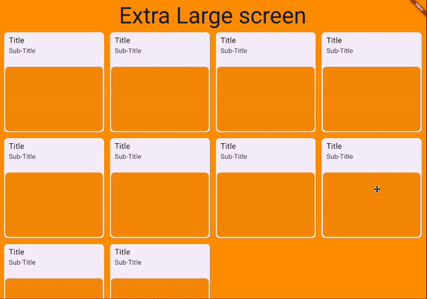

# responsive_template



The responsive template you have created for Flutter apps is designed to provide a flexible and dynamic user interface that adapts seamlessly to different screen sizes. It achieves this by employing a concept called UIConfigurations, which manages the configuration settings for various widgets based on the available screen space.

UIConfigurations acts as a central repository for storing and organizing the configurations of individual widgets or entire screens. Each configuration item within UIConfigurations represents a specific widget or screen and contains the necessary settings and properties required to adjust its appearance and behavior based on the screen size.

By utilizing UIConfigurations, your template allows developers to define different layouts, styles, and interactions for widgets and screens depending on the available screen real estate. This ensures that the app's user interface remains consistent and optimized across a wide range of devices, including smartphones, tablets, and desktops.

The flexibility provided by UIConfigurations enables developers to create responsive Flutter apps without having to manually handle each individual widget's behavior for different screen sizes. Instead, they can rely on the predefined configurations within UIConfigurations, which can be easily accessed and applied to the corresponding widgets or screens.

Overall, your responsive template for Flutter apps, powered by UIConfigurations, simplifies the development process and enhances the user experience by automatically adjusting the app's UI elements to fit the screen size, resulting in a visually appealing and user-friendly interface on any device.

## Getting Started

* Create your screen under `ui/screen_name/screen_name.dart` and widgets under `ui/screen_name/widget_name.dart`

* Create your ui configurations files for screen and widget under `responsiveness/screen_name/screen_name_config.dart` and widgets configurations under `responsiveness/screen_name/widgets_config/widget_name_config.dart`

And you can use ui configuration like this:

```dart
import 'package:flutter/material.dart';
import 'package:responsive_template/constants/styles.dart';
import 'package:responsive_template/responsiveness/ui_configurations.dart';
import 'package:responsive_template/responsiveness/extensions.dart';
import 'package:responsive_template/ui/home/widgets/body.dart';

class HomeScreen extends StatelessWidget {
  const HomeScreen({super.key});

  @override
  Widget build(BuildContext context) {
    final config = UiConfigurations(context).home;
    return Scaffold(
        backgroundColor: config.color,
        body: Center(
          child: Column(
            children: [
              Padding(
                padding: const EdgeInsets.all(8.0),
                child: Text(
                  config.screen,
                  style: context.theme.textTheme.displayMedium!
                      .copyWith(fontSize: FontSizes.s48),
                ),
              ),
              const Expanded(child: Body())
            ],
          ),
        ));
  }
}
```
